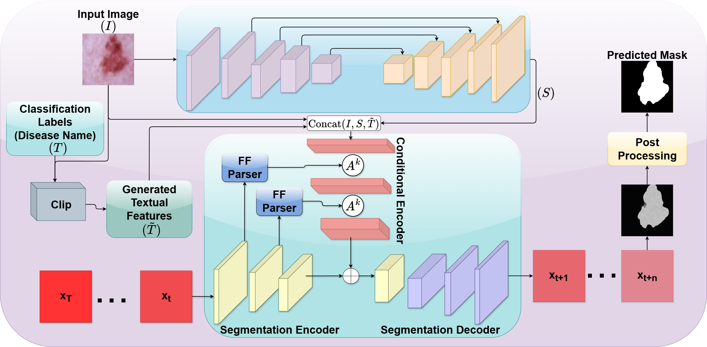

# Guided Diffusion for Skin Lesion Segmentation: Integrating Spatial and Semantic Priors

This repository contains the official implementation of the manuscript:

**“Guided Diffusion for Skin Lesion Segmentation: Integrating Spatial and Semantic Priors”**

Submitted to *The Visual Computer*.

The proposed framework integrates pretrained U-Net-based spatial guidance and CLIP-based semantic guidance within a conditional denoising diffusion model for accurate skin lesion segmentation.

Users of this code are kindly requested to cite the corresponding paper.

---

## Model Architecture

The proposed framework consists of three main components:

1. A pretrained U-shaped network for coarse lesion localization
2. A CLIP-based textual encoder for semantic guidance
3. A denoising diffusion probabilistic model for refined segmentation

<p align="center">
  
  <br>
  <em>Figure 1: Overview of the proposed guided diffusion framework with spatial and semantic priors.</em>
</p>

---

## Requirements

Python 3.8 or later is recommended.

Install the required dependencies using:

```bash
pip install -r requirements.txt
```

---

## Dataset Preparation

The experiments use the ISIC and HAM10000 skin lesion datasets.

### ISIC Dataset

Download the ISIC dataset from:

https://challenge.isic-archive.com/data/

The ISIC experiments use the official training, validation, and test partitions provided with the dataset.

An example directory structure is shown below:

```text
data
└── ISIC
    ├── Test
    │   ├── ISBI2016_ISIC_Part1_Test_GroundTruth.csv
    │   ├── ISBI2016_ISIC_Part1_Test_Data
    │   │   ├── ISIC_0000003.jpg
    │   │   └── ...
    │   └── ISBI2016_ISIC_Part1_Test_GroundTruth
    │       ├── ISIC_0000003_Segmentation.png
    │       └── ...
    └── Train
        ├── ISBI2016_ISIC_Part1_Training_GroundTruth.csv
        ├── ISBI2016_ISIC_Part1_Training_Data
        │   ├── ISIC_0000000.jpg
        │   └── ...
        └── ISBI2016_ISIC_Part1_Training_GroundTruth
            ├── ISIC_0000000_Segmentation.png
            └── ...
```

Ensure that each image is correctly matched with its corresponding segmentation mask.

---

### HAM10000 Dataset

The HAM10000 dermoscopic images and corresponding segmentation masks should be stored in separate directories.

Image and mask filenames are matched using the ISIC image identifier.

Example:

```text
Image: ISIC_0024306.jpg
Mask:  ISIC_0024306_segmentation.png
```

---

## HAM10000 Train and Test Split

The original HAM10000 dataset may contain multiple dermoscopic images associated with the same lesion. Therefore, a direct image-level random split may place images belonging to the same lesion in both the training and test sets.

To prevent lesion-level data leakage, the HAM10000 dataset was divided using the `lesion_id` information provided in the HAM10000 metadata file.

All images associated with the same `lesion_id` were grouped together and assigned entirely to either the training partition or the test partition.

The dataset was divided using an approximately 70:30 train-test ratio at the lesion level.

The exact split used in the experiments is provided in the root directory of this repository:

```text
train_split.csv
test_split.csv
```

* `train_split.csv` contains the HAM10000 training samples.
* `test_split.csv` contains the HAM10000 test samples.
* No `lesion_id` is shared between the two files.
* These files should be used to reproduce the HAM10000 experimental results.

The ISIC dataset does not use these files because the official ISIC dataset partitions were used.

---

## U-Net Spatial Prior

The proposed method uses a pretrained U-Net to generate a coarse lesion segmentation mask. This mask provides spatial guidance to the diffusion model by identifying the approximate lesion region.

The U-Net implementation and training script are included in the root directory:

```text
unet_model.py
unet_train.py
```

* `unet_model.py` contains the U-Net architecture.
* `unet_train.py` contains the U-Net training procedure.

The U-Net should be trained before training the guided diffusion model.

To train the U-Net, run:

```bash
python unet_train.py
```

The trained U-Net model is subsequently used to generate the coarse spatial prior required by the guided diffusion framework.

---

## Training

To train the guided diffusion segmentation model, run:

```bash
python scripts/segmentation_train.py \
--data_name ISIC \
--data_dir <input_data_directory> \
--out_dir <output_directory> \
--image_size 256 \
--num_channels 128 \
--class_cond False \
--num_res_blocks 2 \
--num_heads 1 \
--learn_sigma True \
--use_scale_shift_norm False \
--attention_resolutions 16 \
--diffusion_steps 1000 \
--noise_schedule linear \
--rescale_learned_sigmas False \
--rescale_timesteps False \
--lr 1e-4 \
--batch_size 8
```

Replace `ISIC` with the corresponding dataset name when training on HAM10000.

Trained models will be saved in the specified output directory.

---

## Sampling and Inference

To generate segmentation predictions, run:

```bash
python scripts/segmentation_sample.py \
--data_name ISIC \
--data_dir <input_data_directory> \
--out_dir <output_directory> \
--model_path <saved_model_path> \
--image_size 256 \
--num_channels 128 \
--class_cond False \
--num_res_blocks 2 \
--num_heads 1 \
--learn_sigma True \
--use_scale_shift_norm False \
--attention_resolutions 16 \
--diffusion_steps 1000 \
--noise_schedule linear \
--rescale_learned_sigmas False \
--rescale_timesteps False \
--num_ensemble 5
```

Replace `ISIC` with the corresponding dataset name when performing inference on HAM10000.

By default, generated samples are saved in:

```text
./results/
```

---

## Evaluation

To evaluate the predicted segmentation masks, run:

```bash
python scripts/segmentation_env.py \
--inp_pth <prediction_folder> \
--out_pth <ground_truth_folder>
```

The evaluation script computes the following segmentation metrics:

* Dice coefficient
* Jaccard index

Ensure that the predicted masks and ground-truth masks have matching image identifiers.

---

## Reproducibility

To support reproducibility, this repository provides:

* Complete training and inference scripts
* U-Net architecture and training code
* Dataset preparation instructions
* Dependency specifications
* Model configuration details
* HAM10000 lesion-level training and test split files
* Evaluation scripts

For the HAM10000 experiments, use the provided files:

```text
train_split.csv
test_split.csv
```

These files contain the exact lesion-level split used in the manuscript and ensure that images belonging to the same lesion are not distributed across both the training and test partitions.

For the ISIC experiments, the official dataset split should be used.

---

## Code and Data Archiving

An archived version of this repository will be released on Zenodo with a permanent DOI for long-term accessibility.

The DOI will be added after publication.

---

## Related Publication

This repository is directly related to the following manuscript submitted to *The Visual Computer*:

**“Guided Diffusion for Skin Lesion Segmentation: Integrating Spatial and Semantic Priors”**

Users of this repository are kindly requested to cite the corresponding paper.

---

## Citation

If you use this code, please cite:

```text
The final BibTeX entry and Zenodo DOI will be updated upon acceptance.
```

---

## License

This project is released under the MIT License.

---

## Contact

For questions or implementation-related issues, please open an issue on GitHub.

Repository:

https://github.com/asadidraco/GuidedDiff
